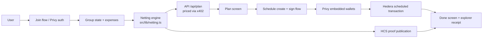

# Architecture — Squash

Squash is a multilateral netting engine built on Hedera, designed to solve the problem of multiple debts among group members efficiently and securely.

## Core Components

### 1. Multilateral Netting Engine
The engine calculates the minimum number of transactions required to settle all debts in a group. It uses a proven solver approach to ensure efficiency, transforming complex sets of debts into a compact, optimized settlement list.

### 2. Atomic Settlement via Hedera Scheduled Transactions
The project leverages Hedera's `ScheduleCreateTransaction` functionality. The entire netting result (all debits and credits) is submitted as a *single* transfer transaction.
- **Atomicity:** The transaction remains in a pending state until every participant has signed.
- **Unit Execution:** The moment the final signature lands, the entire plan executes as a single unit. It is impossible for only half the plan to settle; it is all-or-nothing.

### 3. User Authentication & Wallet Management (Privy)
Squash replaces traditional demo-account key management with **Privy Embedded Wallets**.
- **UX:** Users are authenticated via Privy, and the app generates a dedicated embedded wallet for them, which the application never touches directly.
- **Security:** The app no longer holds private keys. Instead, the application requests transaction signatures from the client-side wallet, ensuring private keys never leave the user's secure context.

### 4. Gatekeeping (x402)
The application utilizes `x402` patterns to gate-keep access. The netting engine itself is a metered resource, requiring payment for each run, ensuring that the service remains sustainable and protected against abuse.

## Transaction Flow

1. **Join:** User authenticates via Privy.
2. **Plan:** The netting engine computes the optimal settlement plan based on input expenses.
3. **Sign:** The app prepares the `ScheduleCreateTransaction`. Participants use their Privy embedded wallet to sign their specific transfer portion.
4. **Settle:** Once all required signatures are gathered, the scheduled transaction executes on the Hedera network, finalizing all settlements instantly.

## System Diagram

## Practical Notes
- The UI is intentionally designed as a demo front end for a real product workflow.
- The core product is the netting engine, not the wallet handling itself.
- The system is structured so the business logic can be reused from any future client, not only the Next.js app.
